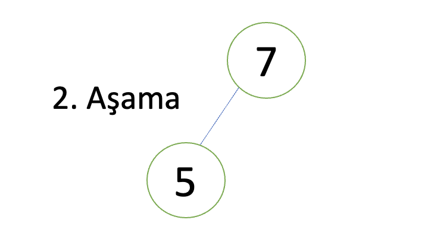
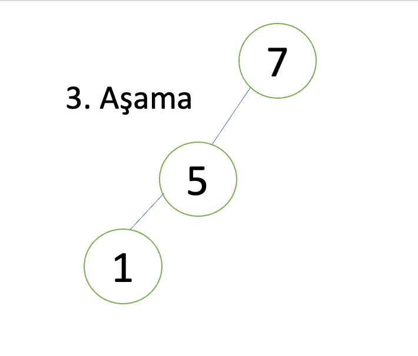
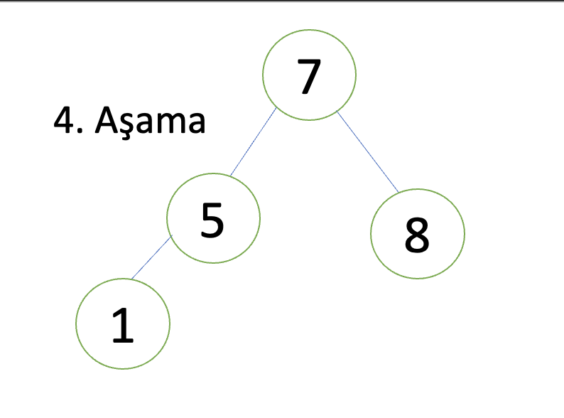
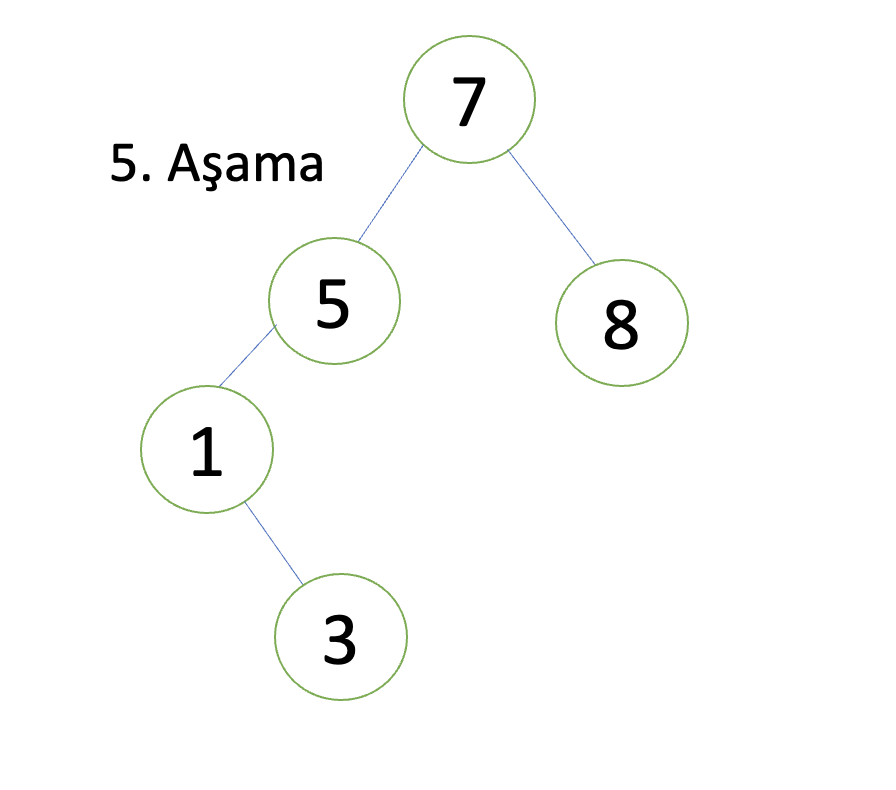
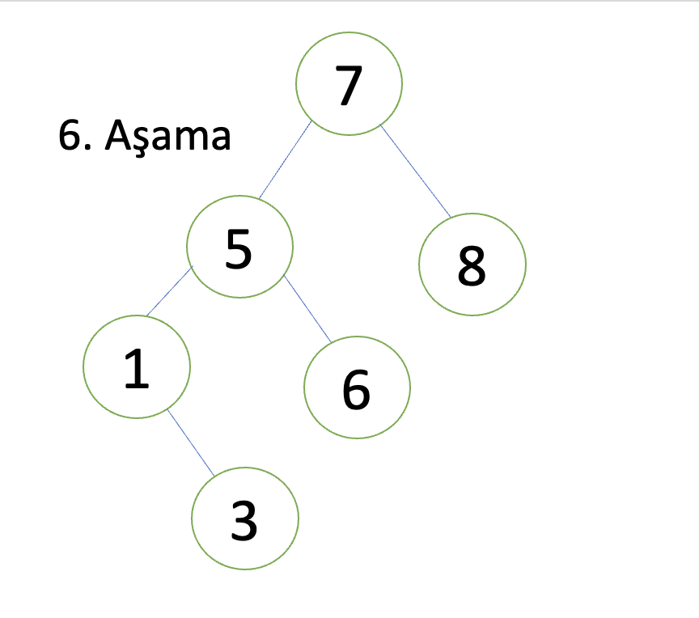
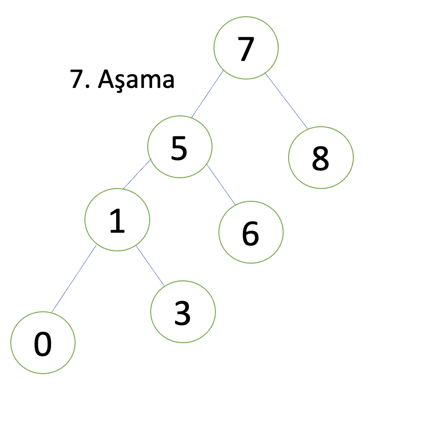
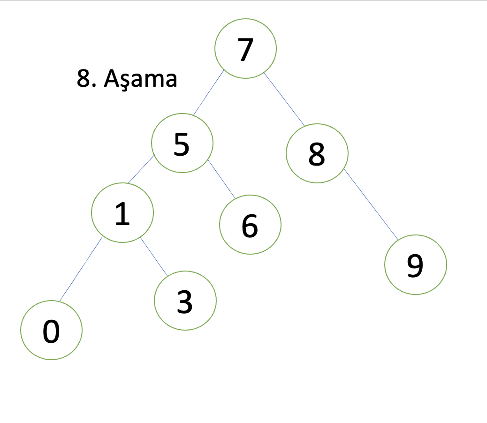
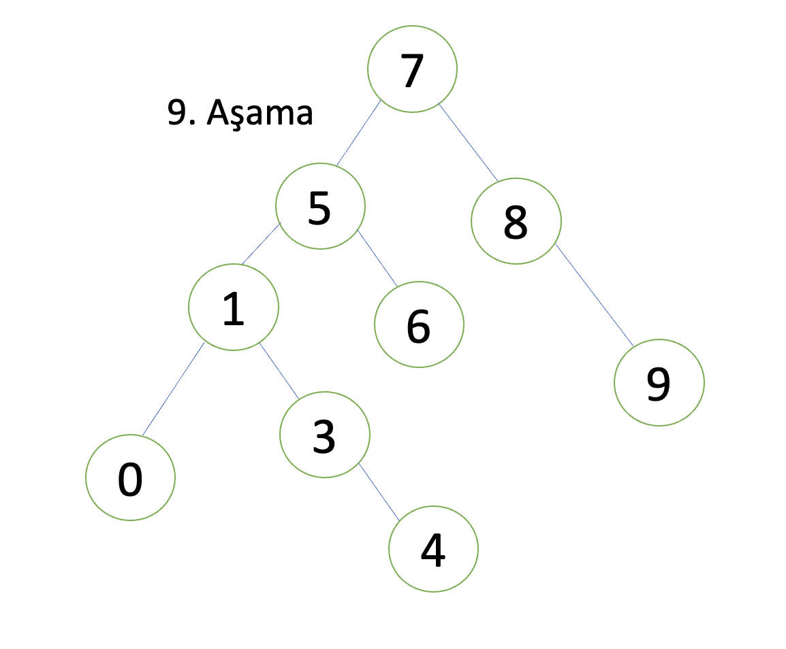
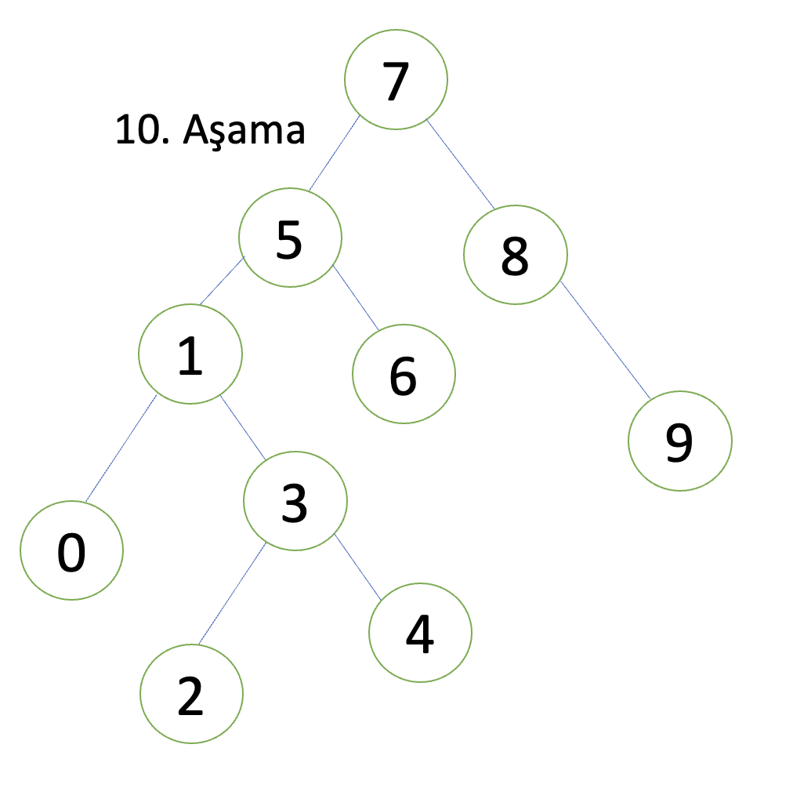

# Binary-Search-Tree-Projesi

[Patika.dev](https://www.patika.dev/tr)

Verilen Dizinin Binary Search Tree Algoritmasına Göre Aşamaları Yazılan Projedir.

## Soru - 1

[7,5,1,8,3,6,0,9,4,2] dizisinin Binary-Search-Tree aşamalarını yazınız.

Verilen dizinin Binary-Search-Tree algoritmasına göre ilk aşaması bu diziden bir root(kök) elemanının seçilmesidir.

Bu algoritmaya göre seçilen ilk eleman **7** olacaktır.

Root elemanı seçildikten sonra sırasıyla gelen elemanlar root(kök)den büyükse root'un sağ altına değilse sol alt tarafına yazılacaktır.

Buna göre;

2.sırada ki 5 değeri 7'den küçük olduğundan 7'nin soluna gelecektir.

3.sırada ki 1 değeri 5'den küçük olduğundan 5'in soluna yazılacaktır.

4.sırada ki 8 değeri 7'den büyük olduğundan 7'nin sağına yazılacaktır.

5.sırada ki 3 değeri ağacın en sonunda ki 1 den büyük olduğu için 1'in sağına gelecektir.
Aslında burada 3 değerinin takip ettiği değerleri sırasıyla yazmak olaki konunun
daha net anlaşılmasına sebep olacağı için burada hemen bunu açıklamak gerekir.

Algoritmaya göre;
1. 3 değeri 7'den büyük olmadığı için sola kaydırılacaktır.
2. Bu sefer 3 değeri 5 değeri ile kıyas edilecektir. Buna göre 3 değeri, 5'den de küçük olduğundan dolayı 5'in sol tarafına geçecektir.
3. En sonunda 3 değeri 1 değeri ile kıyas edilecek ve 3, 1 değerinden büyük olduğu için 1'in sağ tarafına yazılacaktır.

6.sırada ki 6 değeri 5'den büyük olduğu için 5'in sağına yazılacaktır.

7.sırada ki 0 değeri 1'den küçük olduğu için 1'in soluna yazılacaktır.

8.sırada ki 9 değeri 8'den büyük olduğu için 8'in sağına yazılacaktır.

9.sırada ki 4 değeri 3'den büyük olduğu için 3'ün sağına yazılacaktır.

10.sırada ki 2 değeri 3'den küçük olduğu için 3'ün soluna yazılacaktır.

Aslında burada en fazla adım takip eden değer 2 değeri olduğu için 2 değerinin takip ettiği yolu yeniden yazmakta fayda var.

1. 2 değeri kök elemanımız olan 7'den küçüktür. (*2<7*)
2. adımda 2 değeri 5 ile kıyas edilir. 5'ten küçük olduğu için 5'in solundaki değere bakılır.
3. 2 değeri 1'den büyük olduğu için sağ tarafa kaydırılır.
4. 2 değeri 3'den küçük olduğu için 3'ün sol tarafında yerini alır.